# 🚀 Java Workshop - Digital Wallet

A **Spring Boot 4.1** digital wallet application with user management, transactions, and full observability.

---

## ✨ Features

| Feature | Description |
|---------|-------------|
| 💰 **Wallet System** | Auto-created wallets with 16-char hex addresses |
| 👤 **User/Admin APIs** | Role-based CRUD operations |
| 💸 **Transactions** | P2P transfers with balance validation |
| 📊 **Full Observability** | Metrics, logs, traces at all layers |
| 🔒 **Strong Consistency** | ACID transactions, pessimistic locking |
| ⚡ **High Throughput** | 1000+ TPS, HikariCP pooling |

---

## 🚀 Quick Start

```bash
# Start everything
docker compose up -d

# Check health
curl http://localhost:8080/actuator/health
```

---

## 🔗 Endpoints

| Type | URL | Description |
|------|-----|-------------|
| **App** | http://localhost:8080 | Application |
| **Grafana** | http://localhost:3000 | Dashboards (admin/admin) |
| **Prometheus** | http://localhost:9090 | Metrics |

### API Overview
```
POST /api/v1/auth/register     # Register + create wallet
POST /api/v1/auth/login        # Get JWT token

GET  /api/v1/users/me          # Own profile
GET  /api/v1/wallet            # View balance
POST /api/v1/wallet/deposit    # Add money
POST /api/v1/wallet/withdraw   # Withdraw
POST /api/v1/transactions      # Transfer money

GET  /api/v1/admin/users       # (Admin) List all users
```

---

## 📊 Dashboards

| Dashboard | Metrics |
|-----------|---------|
| **JVM** | Memory, threads, GC, CPU |
| **HTTP** | Request rate, latency, errors |
| **Logs** | Log volume, errors, search |
| **Traces** | Request flows, slow traces |

---

## 🏗️ Architecture

```mermaid
flowchart TB
    subgraph Client
        A[Web/Mobile App]
    end
    
    subgraph Application["Spring Boot Application"]
        B[Controllers]
        C[Services]
        D[Repositories]
    end
    
    subgraph Data
        E[(PostgreSQL)]
    end
    
    subgraph Observability
        F[OTEL Collector]
        G[Prometheus]
        H[Loki]
        I[Tempo]
        J[Grafana]
    end
    
    A --> B
    B --> C
    C --> D
    D --> E
    
    B & C & D -.->|metrics/traces| F
    F --> G & H & I
    G & H & I --> J
```



---

## 📁 Project Structure

```
java-workshop/
├── specifications/           # Requirements, design, tasks
├── src/main/java/.../
│   ├── controller/          # REST endpoints
│   ├── service/             # Business logic
│   ├── repository/          # Data access
│   └── entity/              # User, Wallet, Transaction
├── observability/           # Grafana, OTEL configs
└── compose.yaml             # Docker setup
```

---

## 🐳 Services

| Container | Port |
|-----------|------|
| workshop-app | 8080 |
| workshop-postgres | 5432 |
| workshop-grafana | 3000 |
| workshop-prometheus | 9090 |
| workshop-loki | 3100 |
| workshop-tempo | 3200 |
| workshop-otel-collector | 4317/4318 |

---

## 🎯 Current Sprint

| Phase | Status | Progress |
|-------|--------|----------|
| Phase 1: Project Setup | ✅ Complete | Spring Boot 4.1, PostgreSQL, Prometheus |
| Phase 2: Observability | ✅ Complete | Grafana, Loki, Tempo, dashboards |
| Phase 3: Entity & Repository | ✅ Complete | Entities, repositories, migrations, 44 tests |
| Phase 4: Service Layer | ✅ Complete | UserService, WalletService, TransactionService, 71 tests |
| Phase 5: Controllers | ✅ Complete | REST endpoints, GlobalExceptionHandler, 86 tests |
| **Phase 6: Security** | 🚧 Next | JWT, roles, BCrypt |

**Run tests**: `./run-tests.sh`

---

## 📋 Documentation

| Document | Description |
|----------|-------------|
| 📄 [Requirements](specifications/requirements.md) | Features, NFRs, security requirements |
| 🏛️ [Design](specifications/design.md) | Domain model, APIs, consistency design |
| ✅ [Tasks](specifications/tasks.md) | Implementation checklist with status |

---

<p align="center">Made with ☕ and Spring Boot</p>
